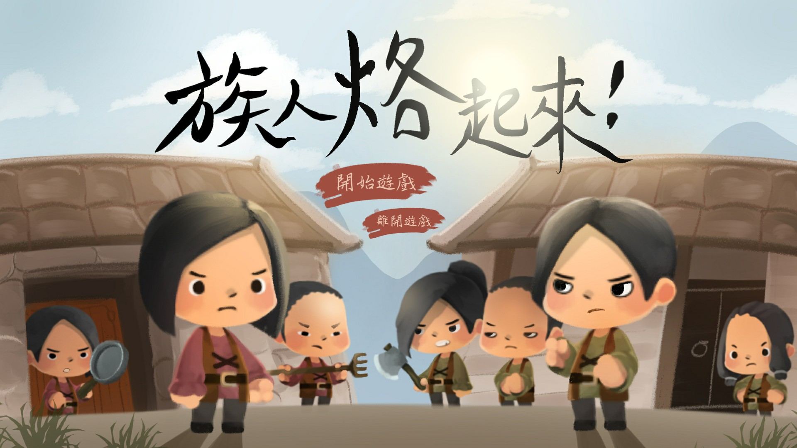
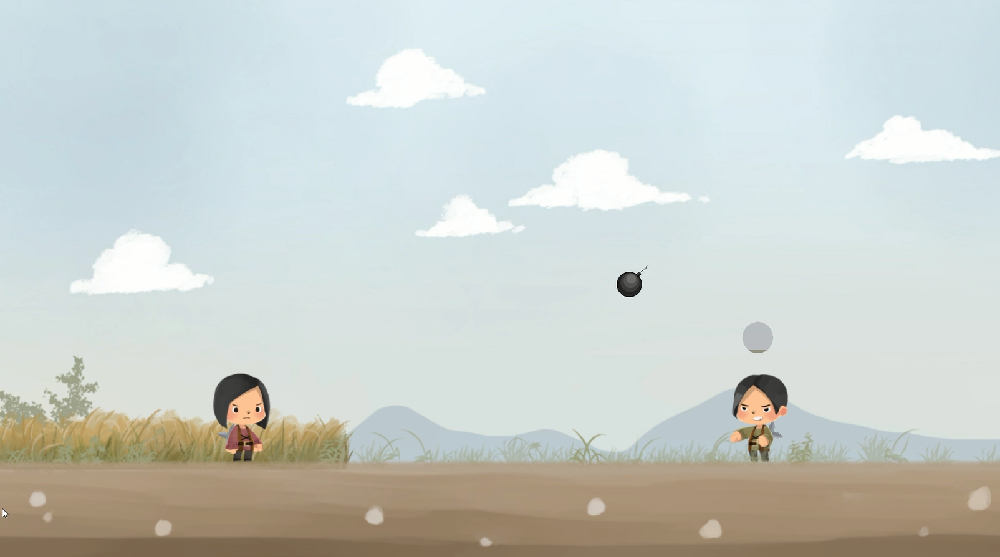
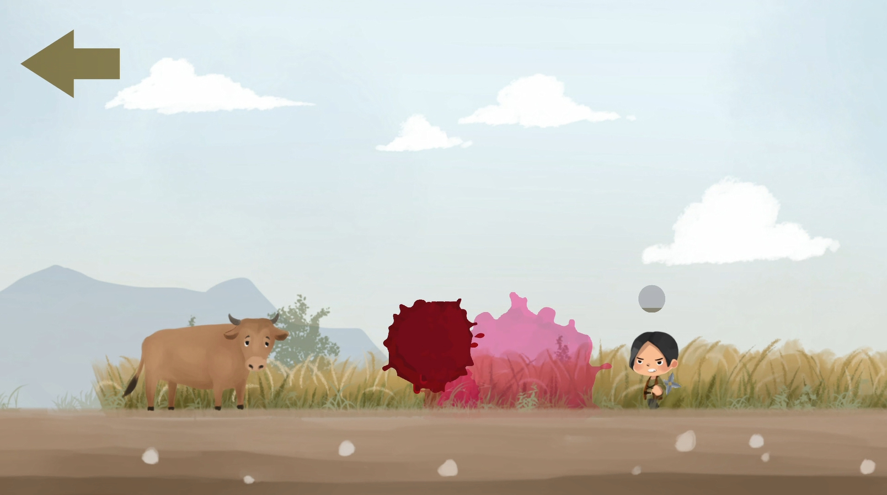
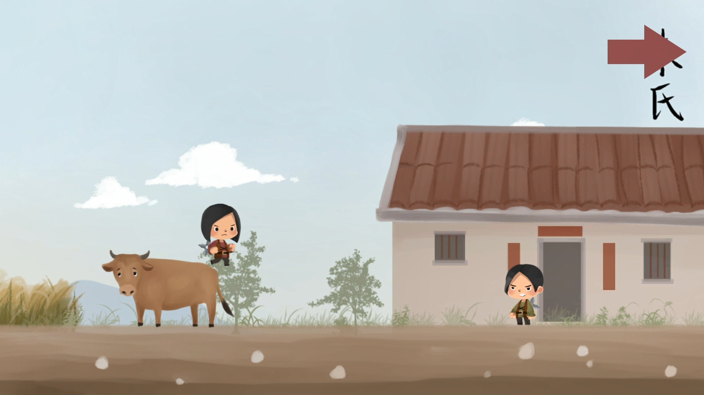
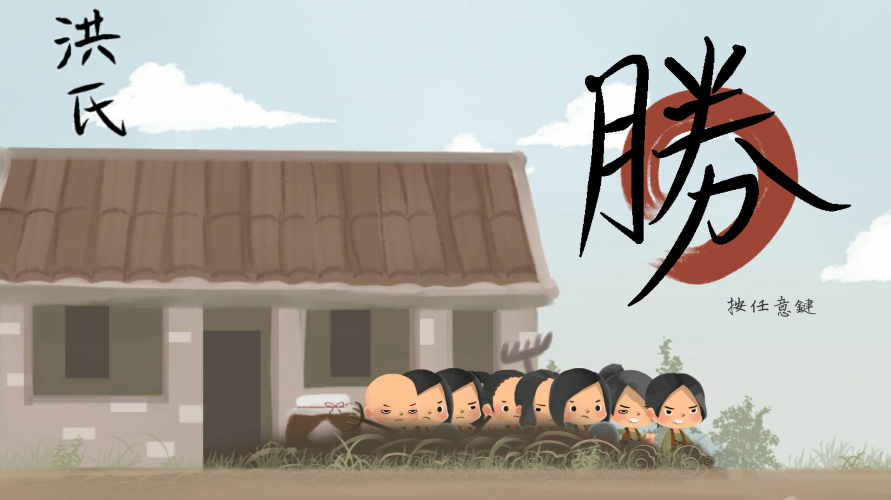

# Tribe Game

- Introduction to Game Programming (by professor Hung-Kuo Chu)
- Team21: 王士亞 林柏毅 張子宜 張廖祐祺
- A game designed by Unity2D.

## Introduction
It's a story between two ancient tribe families, Chu and Hung.  The members of the two feuding families couldn't stand each other and get into a fight whenever they meet.
You and your friend, sadly to say, are from different tribes.  Try to defeat him/her and run back to home to get some help!

## How to Play
1 computer, 2 people.  Use keyboard to move your character and attack.

## Game Resource
- game video cut: https://www.youtube.com/playlist?list=PLvjiHq0nC8WsPWRm_1i6hheeVh9evHJ0r
- Download whole final_0107_exe folder to play the game!

